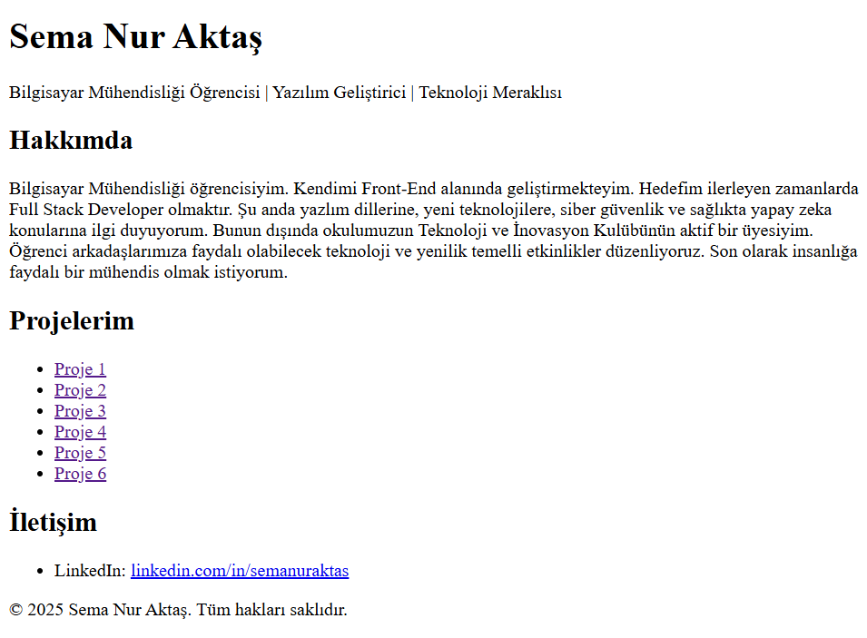

# Sema Nur Aktaş - Kişisel Tanıtım Sayfası 

Merhaba! Ben **Sema Nur Aktaş**. Bilgisayar Mühendisliği 3. sınıf öğrencisiyim. Front-End geliştirme alanında kendimi geliştiriyorum. Bu proje, HTML öğrenme sürecimde yaptığım ilk kişisel tanıtım sayfasıdır.

## Proje Hakkında

Bu proje basit bir kişisel web sayfasıdır ve sadece **HTML** kullanılarak oluşturulmuştur. Sayfa aşağıdaki bölümlerden oluşur:

- Hakkımda
- Projelerim (Github Bağlantılı)
- İletişim
- Footer

## Proje Linkleri

| Proje Adı | Açıklama | Link |
|----------|----------|------|
| Proje 1 | Kodluyoruz İlk Repo | [GitHub](https://github.com/semanurakts/kodluyoruzilkrepo.git) |
| Proje 2 | HTML Ödev 1 | [GitHub](https://github.com/semanurakts/HTMLOdev1.git) |
| Proje 3 | HTML Ödev 2 | [GitHub](https://github.com/semanurakts/HTMLOdev2.git) |
| Proje 4 | HTML Ödev 3 | [GitHub](https://github.com/semanurakts/HTMLOdev3.git) |
| Proje 5 | CSS Ödev 1 | [GitHub](https://github.com/semanurakts/CSSOdev1.git) |

## İletişim Bilgileri

Beni LinkedIn üzerinden takip edebilirsiniz: [linkedin.com/in/semanuraktas](https://www.linkedin.com/in/semanuraktas/)

## Geliştirme Aşamaları

- HTML öğrenildi.
- CSS öğreniliyor.
- JavaScript ile interaktif özellikler eklenecek.

## Sayfa Görseli

[Kişisel Tanıtım Sayfası](https://semanurakts.github.io/KisiselTanitimSayfasi/KişiselTanıtımSayfası.html)

## Lisans

Bu proje tamamen öğrenme amaçlıdır.
